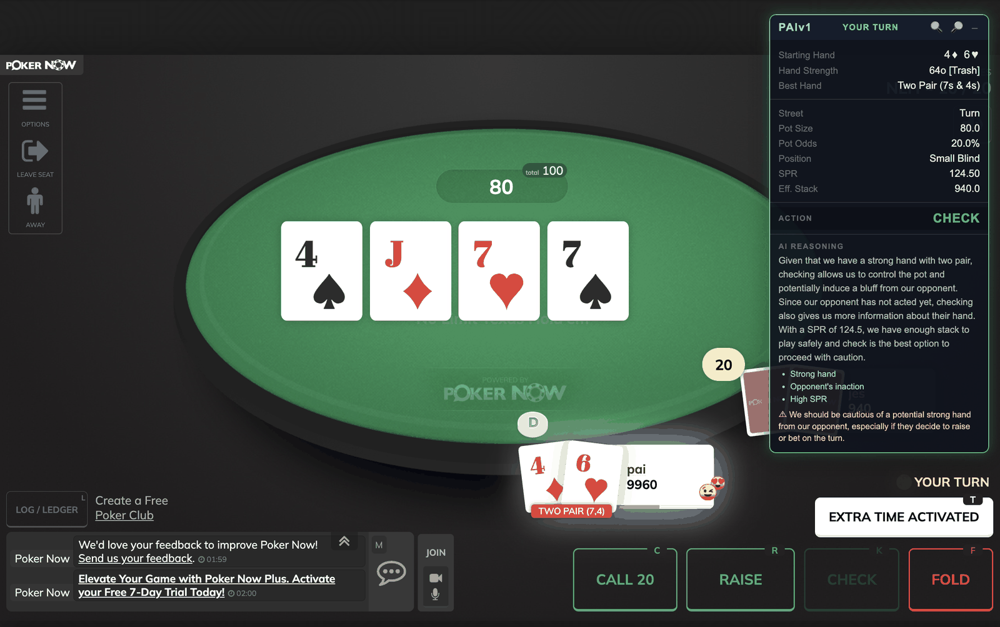

# PAIv1



PAIv1 is a real-time poker assistant for [PokerNow](https://www.pokernow.club).
It reads the live table straight out of the browser, works out where you stand, and shows a recommended action in a floating overlay along with the reasoning behind it.

I built this AI assistant to integrate with PokerNow which is a popular website where my friends and I can load a quick poker game. The tool can also be highly used for education of the game and teach beginners the fundamentals.

---

## What it does

- Reads live game state from the PokerNow tab every 2 seconds over Selenium, entirely local.
- Computes hand strength, best 5-card hand, pot odds, position, SPR and effective stack.
- Recommends an action, a bet size when raising, and the amount when calling.
- Renders it all in an overlay injected directly into the PokerNow tab, no extension to install.

| Street | Decided by |
|--------|------------|
| Preflop | GTO lookup table, 169 hands x 5 positions, instant |
| Flop / Turn / River | LLM that sees the board, stacks, bets and action history, then explains its choice |

---

## Setup

Python 3.10+ and Google Chrome.

```bash
git clone https://github.com/JessupByun/PAIv1.git
cd PAIv1
python3 -m venv venv && source venv/bin/activate
pip install -r requirements.txt
cp .env.example .env      # then add your GROQ_API_KEY
```

A Groq API key is free at [console.groq.com](https://console.groq.com).

One-time Chrome flag: enable `chrome://flags/#allow-insecure-localhost`, so the overlay's WebSocket can reach the local backend from an `https://` page.

---

## Run

```bash
python main.py
```

Chrome opens, you log into PokerNow, press Enter, then paste your table URL.
The overlay appears top-right, updates every 2 seconds, and glows green when it is your turn.

| Env var | Default | Purpose |
|---------|---------|---------|
| `GROQ_API_KEY` | required | Groq API key |
| `PAI_LLM_MODEL` | `openai/gpt-oss-120b` | `qwen/qwen3.8-27b` is roughly twice as fast |
| `PAI_WS_PORT` | `8765` | WebSocket port for the overlay |
| `PAI_BLUFF_RATE` | `0.35` | How often the model is nudged toward a bluff; `0` disables it |
| `PAI_DEBUG` | off | `1` prints the full LLM prompt and response |

---

## Layout

```
main.py                    game loop, overlay injection, LLM trigger
backend/
  util.py                  shared game-summary parsing
  hand_strength.py         Sklansky & Malmuth starting-hand tiers
  eval_best_hand.py        best 5-card hand, via treys
  pot_odds.py              pot odds
  preflop_table.py         GTO preflop ranges
  heuristics.py            position, SPR, effective stack, bet sizing
  ws_server.py             WebSocket broadcast to the overlay
  LLM_deployment.py        Groq call, prompt, response parsing
frontend/                  overlay UI, vanilla JS and CSS
tests/                     pytest suite
```

---

## Tests

```bash
pytest                     # everything except the live API call
pytest -m integration      # real Groq call, needs a key
```

